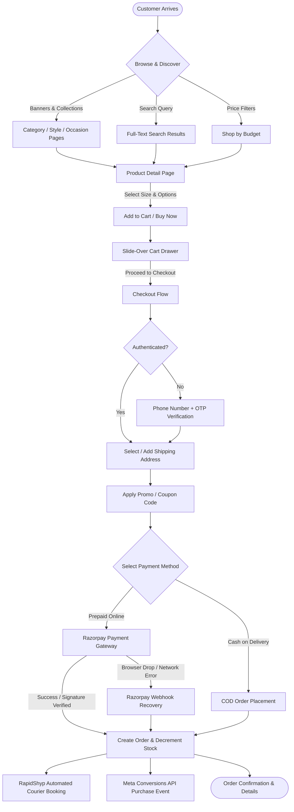
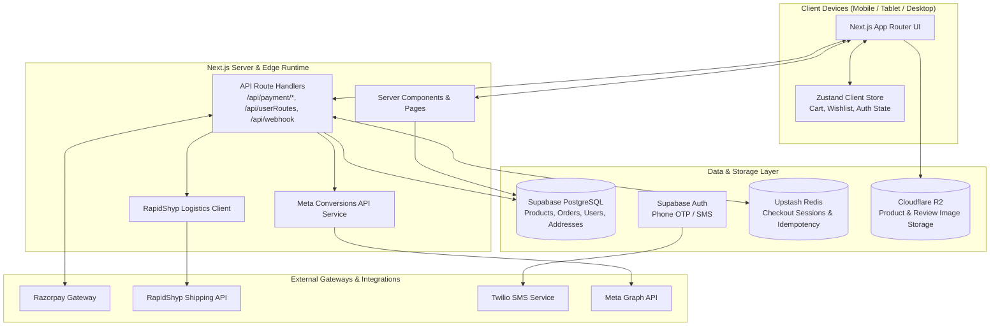
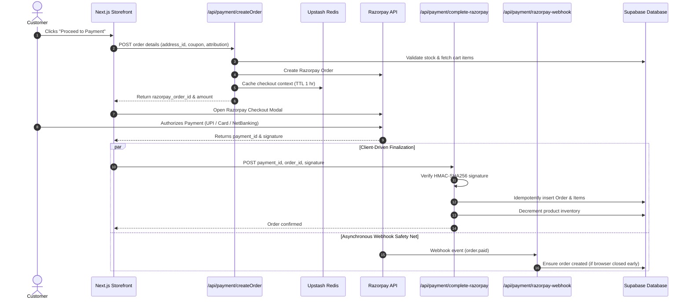

# 💎 The Jwel — Modern Jewellery E-Commerce Storefront

[](https://nextjs.org/)
[](https://react.dev/)
[](https://www.typescriptlang.org/)
[](https://tailwindcss.com/)
[](https://supabase.com/)
[](https://razorpay.com/)
[](https://upstash.com/)
[](https://www.cloudflare.com/products/r2/)

A luxury, production-grade e-commerce storefront engineered for **The Jwel** — a premier jewellery brand specializing in high-grade American Diamond and handcrafted Temple Jewellery.

Built with **Next.js 16 (App Router)**, **React 19**, **TypeScript**, **Tailwind CSS v4**, and **Supabase**, this storefront offers a lightning-fast, mobile-first shopping experience. It features full catalog browsing, dynamic styling and occasion collections, full-text database search, dual-mode persistent cart syncing, seamless mobile OTP authentication, and an end-to-end checkout pipeline powered by **Razorpay** and **Cash on Delivery (COD)**.

---

## ✨ Features

### 🛍️ Shopping & Discovery Experience
- **Catalog & Category Navigation**: Multi-level categorization covering necklaces, earrings, bangles, rings, and curated sets with subcategory filtering pills.
- **Shop by Style & Occasion**: Dynamic collections for styles (*American Diamond, Temple Jewellery, Polki, Kundan, Minimalist*) and occasions (*Bridal & Wedding, Festive, Everyday Wear, Party Wear, Office Wear*).
- **Shop by Budget**: Quick-access price bands (*Under ₹499, Under ₹999, Under ₹1,499, Under ₹1,999*) for budget-driven conversions.
- **Product Display & Media**: High-resolution image galleries with Swiper touch slider, pinch/zoom preview modal, product weight, dimensions, SKU tracking, and real-time inventory counters.
- **Variant & Size Selection**: Dynamic size options with instantaneous UI feedback and stock checking.
- **PostgreSQL Full-Text Search**: Fast catalog search with trigram fuzzy matching (`product_search_vector_func`) across product names, descriptions, tags, and categories.
- **Customer Reviews & Photo Uploads**: Verified customer reviews with star ratings, detailed feedback, and photo attachments stored on Cloudflare R2.
- **Wishlist Management**: Instant heart-toggle wishlist backed by Zustand on the client and synchronized with Supabase for logged-in accounts.

### 💳 Checkout & Payments
- **Frictionless Phone OTP Authentication**: Instant customer sign-in via phone number and SMS verification, eliminating password friction while linking cart, wishlist, and orders.
- **Saved Address Book**: Multi-address management allowing customers to save, edit, and select delivery locations with landmark, postal code, and house details.
- **Coupon & Promotion Engine**: Support for percentage and flat discounts, cart threshold validations, prepaid-exclusive promotional incentives, and real-time coupon verification.
- **Dual Payment Channels**:
  - **Razorpay Prepaid**: Seamless integration for UPI (Google Pay, PhonePe, Paytm), Credit/Debit Cards, NetBanking, and Wallets.
  - **Cash on Delivery (COD)**: Option for full COD or partial COD shipping fee confirmation.
- **Idempotent Order Finalization**: Checkout sessions managed in Upstash Redis, preventing double charges and race conditions.
- **Dual-Path Payment Verification**: Client-side instant verification backed by a server-side **Razorpay Webhook** (`/api/payment/razorpay-webhook`) to guarantee zero lost orders if a customer closes the browser prematurely.
- **Automated Inventory Management**: Automatic stock decrements upon order placement.
- **Automated Logistics Dispatch**: RapidShyp integration for automated shipment booking with courier partners.

### 📱 Responsive & Mobile-First Design
- **Tailored for Mobile Shoppers**: Designed specifically for high-converting mobile commerce with touch-friendly navigation, sticky bottom action bars, bottom-sheet drawers, and smooth gesture transitions.
- **Adaptive Layouts**: Responsive grids optimized across mobile handsets, tablets, laptops, and ultra-wide displays.
- **Slide-Over Cart & Drawers**: Effortless cart adjustments without reloading or disrupting the browsing journey.

### ⚡ Performance, UX & SEO
- **Hybrid Rendering**: Fast server-side rendered (SSR) catalog pages combined with fluid client-side hydration where interactivity is needed.
- **Optimized Asset Delivery**: Product and banner imagery served via Cloudflare R2 CDN with responsive sizing.
- **Comprehensive Technical SEO**:
  - Dynamic `sitemap.xml` and `robots.txt` generation based on live database products and categories.
  - Canonical URLs, OpenGraph previews, and Twitter summary cards on every page.
  - Rich JSON-LD structured data (`Product`, `BreadcrumbList`, `ItemList`, `Organization`, `WebSite`).
- **Marketing & Attribution Analytics**: Integrated Meta Pixel and server-side **Meta Conversions API (CAPI)** with complete UTM attribution tracking, alongside Google Analytics.

---

## 🧭 Storefront Flow

The diagram below maps the end-to-end customer journey from landing to order confirmation:



---

## 🏗️ Architecture

### High-Level System Architecture



### Payment & Order Finalization Flow



---

## 🗂️ Project Structure

An overview of key directories and modules in this repository:

```
thejwel-master/
├── public/                     # Static assets, branding icons, and manifests
├── src/
│   ├── app/                    # Next.js App Router root
│   │   ├── (main)/             # Main customer-facing route group
│   │   │   ├── (auth)/         # Auth confirmation and error pages
│   │   │   ├── account/        # Customer profile, addresses, and order history
│   │   │   │   └── orders/     # Order tracking and receipt views
│   │   │   ├── api/            # Serverless API endpoints
│   │   │   │   ├── payment/    # Razorpay, COD, coupons, and webhooks
│   │   │   │   ├── upload/     # S3 / Cloudflare R2 image upload endpoint
│   │   │   │   ├── userRoutes/ # Phone sign-in user, cart & wishlist bootstrapping
│   │   │   │   └── webhook/    # Order webhook handler
│   │   │   ├── budget/         # Shop-by-budget dynamic route ([range])
│   │   │   ├── category/       # Category catalog dynamic route ([categoryslug])
│   │   │   ├── occasion/       # Occasion-specific dynamic route ([occasion])
│   │   │   ├── product/        # Product detail dynamic route ([product_id])
│   │   │   ├── search/         # Database full-text search ([product_arg])
│   │   │   ├── style/          # Jewellery style dynamic route ([style])
│   │   │   ├── wishlist/       # Customer wishlist page
│   │   │   ├── layout.tsx      # Root layout with fonts, providers, and global SEO
│   │   │   └── page.tsx        # Homepage with dynamic hero, carousels, and grids
│   │   ├── opengraph-image.tsx # Dynamic OpenGraph social card generator
│   │   ├── robots.ts           # Dynamic crawling rules
│   │   ├── sitemap.ts          # Automated sitemap covering all dynamic products & categories
│   │   └── utils/              # Server-side business logic and utilities
│   │       ├── orderCheckout.ts       # Cart calculation, shipping fees & order drafting
│   │       ├── finalizePrepaidOrder.ts# Idempotent order creator & Meta CAPI sender
│   │       ├── rapidShyp.ts           # Automated courier partner booking
│   │       ├── stockAdjustment.ts     # Inventory decrement helper
│   │       ├── cloudflare.ts          # S3-compatible SigV4 Cloudflare R2 upload client
│   │       └── Redis.ts               # Upstash Redis client
│   │
│   ├── components/             # Reusable UI component library
│   │   ├── Address/            # Address forms and selection cards
│   │   ├── AuthUI/             # Phone number and OTP verification components
│   │   ├── CartUI/             # Cart drawer and line-item components
│   │   ├── NavbarUI/           # Desktop navbar, search overlay, and mobile drawer
│   │   ├── Payment/            # Checkout modal, Razorpay trigger, COD confirmation
│   │   ├── ProductUI/          # ProductCard, ProductDisplay, Carousels, Reviews
│   │   ├── analytics/          # Meta Pixel, Google Analytics, Route trackers
│   │   └── seo/                # JSON-LD structured data renderer
│   │
│   ├── lib/                    # Configuration modules and database connectors
│   │   ├── meta/               # Client Meta Pixel & Server Conversions API (CAPI)
│   │   ├── seo/                # Metadata generators and canonical URL helpers
│   │   ├── supabase-Utils/     # Supabase client, server, admin & middleware instances
│   │   └── shipping-config.ts  # Configurable shipping rules and free delivery limits
│   │
│   ├── schema/                 # Database schema reference and SQL migration notes
│   ├── types/                  # TypeScript interfaces and data contracts
│   ├── utilityFunctions/       # Client-side helpers (cart, wishlist, sharing, auth)
│   └── zustandStore/           # Global client state (cart, auth, checkout, modals)
│
├── .env.example                # Template for environment variables
├── next.config.ts              # Next.js server configuration and remote image patterns
├── package.json                # Project dependencies and operational scripts
└── tsconfig.json               # TypeScript compiler configuration
```

---

## 🛠️ Tech Stack

| Technology | Purpose |
|---|---|
| **Next.js 16 (App Router)** | Full-stack React framework providing SSR, Server Components, and API Route Handlers |
| **React 19** | Modern UI component architecture with enhanced concurrency and hooks |
| **TypeScript** | Strict compile-time type safety across database schemas, APIs, and components |
| **Tailwind CSS v4** | High-performance modern utility styling engine |
| **Supabase** | Cloud PostgreSQL database, Row Level Security (RLS), and Phone OTP authentication |
| **Razorpay** | Online payment gateway supporting UPI, Cards, NetBanking, and signature verification |
| **Upstash Redis** | Serverless Redis for checkout session caching and idempotent order finalization |
| **Cloudflare R2** | S3-compatible zero-egress object storage for product and review imagery |
| **RapidShyp** | Automated logistics and courier dispatch integration |
| **Twilio** | SMS provider for customer OTP verification and order alerts |
| **Framer Motion 12** | Micro-interactions, smooth modals, and animated page transitions |
| **Swiper 14** | Touch-enabled mobile image galleries and responsive product carousels |
| **Zustand 5** | Lightweight client-side store for cart, wishlist, and modal states |
| **Meta Pixel & CAPI** | Full-funnel ad tracking with server-side Conversions API deduplication |
| **Vercel** | Edge deployment platform with automated builds and Speed Insights |

---

## 🔐 Environment Variables

Create a `.env.local` file in the project root by copying the provided [.env.example](file:///.env.example):

```bash
cp .env.example .env.local
```

Populate the required keys according to your deployment environment:

```env
# ==============================================================================
# 1. SUPABASE (Required)
# ==============================================================================
NEXT_PUBLIC_SUPABASE_URL="https://your-project-ref.supabase.co"
NEXT_PUBLIC_SUPABASE_PUBLISHABLE_KEY="your-supabase-publishable-anon-key"
SUPABASE_SECRET_KEY="your-supabase-service-role-secret-key"

# ==============================================================================
# 2. SITE CONFIGURATION & SEO
# ==============================================================================
NEXT_PUBLIC_SITE_URL="http://localhost:3000"
SITE_URL="http://localhost:3000"
NEXT_PUBLIC_SITE_NAME="The Jwel"

# ==============================================================================
# 3. RAZORPAY (Payments)
# ==============================================================================
NEXT_PUBLIC_RAZORPAY_KEY_ID="rzp_test_xxxxxxxxxxxxxxxx"
RAZORPAY_KEY_ID="rzp_test_xxxxxxxxxxxxxxxx"
RAZORPAY_KEY_SECRET="your-razorpay-key-secret"
RAZORPAY_WEBHOOK_SECRET="your-razorpay-webhook-secret"

# ==============================================================================
# 4. UPSTASH REDIS (Checkout Sessions & Caching)
# ==============================================================================
UPSTASH_REDIS_REST_URL="https://your-instance.upstash.io"
UPSTASH_REDIS_REST_TOKEN="your-upstash-rest-token"

# ==============================================================================
# 5. CLOUDFLARE R2 (Image Storage & CDN)
# ==============================================================================
CLOUDFLARE_R2_ACCESS_KEY_ID="your-cloudflare-r2-access-key-id"
CLOUDFLARE_R2_SECRET_ACCESS_KEY="your-cloudflare-r2-secret-access-key"
CLOUDFLARE_R2_ENDPOINT="https://your-account-id.r2.cloudflarestorage.com"
CLOUDFLARE_R2_BUCKET_NAME="thejwel-bucket"
CLOUDFLARE_R2_PUBLIC_URL="https://cdn.yourdomain.com"

# ==============================================================================
# 6. META TRACKING (Pixel & Conversions API)
# ==============================================================================
NEXT_PUBLIC_META_PIXEL_ID="your-meta-pixel-id"
META_CAPI_ACCESS_TOKEN="your-meta-conversions-api-token"
META_TEST_EVENT_CODE=""

# ==============================================================================
# 7. SHIPPING POLICIES
# ==============================================================================
NEXT_PUBLIC_SHIPPING_FEE="49"
NEXT_PUBLIC_FREE_SHIPPING_THRESHOLD="499"
NEXT_PUBLIC_SHIPPING_ENABLED="true"

# ==============================================================================
# 8. RAPIDSHYP (Optional Logistics Integration)
# ==============================================================================
RAPIDSHYP_API_KEY="your-rapidshyp-api-token"
RAPIDSHYP_PICKUP_ADDRESS_NAME="Primary Warehouse"
RAPIDSHYP_STORE_NAME="The Jwel"

# ==============================================================================
# 9. TWILIO (Optional SMS Service)
# ==============================================================================
TWILIO_ACCOUNT_SID="ACxxxxxxxxxxxxxxxxxxxxxxxxxxxxxxxx"
TWILIO_AUTH_TOKEN="your-twilio-auth-token"
```

---

## 🚀 Getting Started

Follow these steps to run the storefront on your local machine:

### 1. Prerequisites
- **Node.js**: v20 or higher installed
- **pnpm**: v10+ recommended (this repository uses `pnpm@10.28.2`)

```bash
# Enable or install pnpm if needed
corepack enable
# or
npm install -g pnpm
```

### 2. Install Dependencies
```bash
pnpm install
```

### 3. Configure Environment Variables
Copy `.env.example` to `.env.local` and configure your database and API credentials:
```bash
cp .env.example .env.local
```

### 4. Start the Development Server
```bash
pnpm dev
```

Visit [http://localhost:3000](http://localhost:3000) in your browser to view the storefront.

### 5. Build for Production
To create and verify an optimized production bundle:
```bash
pnpm build
pnpm start
```

---

## 🚢 Deployment & Production Notes

- **Vercel**: Deploy directly by connecting the GitHub repository. Add the environment variables from `.env.local` to the Vercel Project Settings.
- **Supabase**: Ensure Row Level Security (RLS) policies are active and the full-text search index (`search_vector`) trigger is registered on the `products` table.
- **Razorpay Webhooks**: Configure your Razorpay dashboard webhook to point to `https://your-domain.com/api/payment/razorpay-webhook` with event `order.paid` and secret `RAZORPAY_WEBHOOK_SECRET`.
- **Cloudflare R2**: Ensure CORS permissions are configured on the R2 bucket to permit direct browser uploads for customer reviews.
- **Images**: Remote domains for product images are configured in [next.config.ts](file:///next.config.ts). If you are using custom CDN domains, add them under `images.remotePatterns`.

---

## 📄 License & Attribution

This project is a client-delivered proprietary e-commerce storefront for **The Jwel**. All rights reserved.
